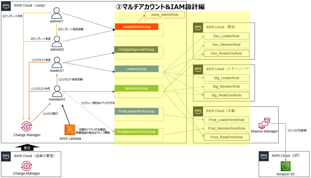

# aws-multi-account-iam-design-with-jump-account
マルチアカウントにおけるJumpアカウントを用いたIMA設計の CloudFormation テンプレート

## 概要
AWSでマルチアカウント構成にした際に、Jumpアカウント方式で各AWSアカウントにログインする手法があります。  
利用者は、まずJumpアカウントにログインし、各AWSアカウントへスイッチロールすることでログインすることができます。  
各AWSアカウントでどのような操作を許可するかは、スイッチ先のロールに対して必要な権限を付与します。

## 各種ファイル

| ファイル名 | 説明 |
| ------------- | ------------- |
| IAM-Jump.yaml | Jumpアカウントに展開するCloudFormationテンプレート |
| IAM-SwitchRole-Dev.yaml | Devアカウントに展開するCloudFormationテンプレート |
| IAM-SwitchRole-Stg.yaml | Stgアカウントに展開するCloudFormationテンプレート |
| IAM-SwitchRole-Prod.yaml | Prodアカウントに展開するCloudFormationテンプレート |

## 使い方

[こちらのブログ](https://yuj1osm.hatenablog.com/entry/2025/01/12/162426)を参考にしてください。